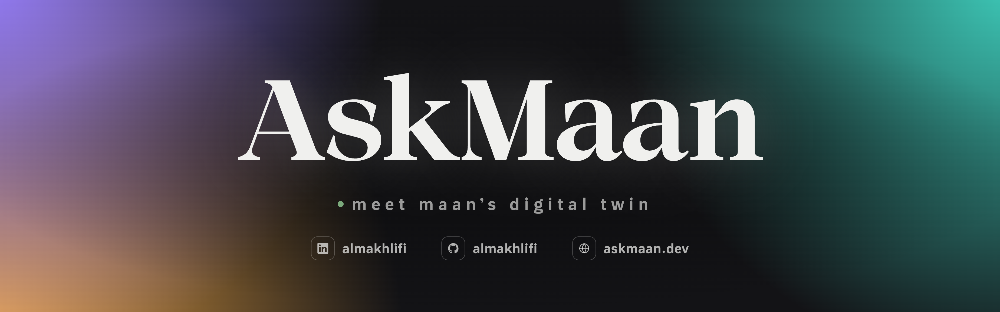

# AskMaan



**Live at [askmaan.dev](https://askmaan.dev)**

AskMaan is my personal website, built as an AI chatbot instead of a static portfolio. The assistant's name is Twin: a digital twin of me that visitors (recruiters, colleagues, anyone curious) can ask about my background, education, projects, skills, and experience, and it answers in a structured, conversational way, like talking to an assistant who knows my work inside out.

## What it does

- Answers questions about me from a curated knowledge base. It doesn't invent facts, and anything it doesn't know gets redirected to my LinkedIn
- Adapts its reply format to the question: short prose, bullet points, or numbered lists, with key facts bolded
- Keeps the conversation going: every answer ends with a relevant follow-up offer, and a simple "yes" or "no" is understood as the reply to it
- Stays on-topic and resists prompt-injection attempts through layered defenses
- Speaks both English and Arabic, with a one-tap language toggle in the header. The Arabic side has the exact same knowledge, rules, and way of talking
- Opens with a cinematic intro animation: "AskMaan" (or "اسأل معن" in Arabic) fades in over a dark screen, then reveals the chat
- A live status dot in the header shows green "online" when Twin is reachable and yellow "connecting" when the API is down and it's reconnecting
- Streams replies in word by word as Twin writes them
- Offers a PlayAces app preview and only shows it once you say yes (or ask to see it), opening on the App Store tab with a Google Play toggle and a tap-to-enlarge screenshot viewer
- Shows tap-through cards in the chat for booking a meeting, LinkedIn, and GitHub when that's what you asked for
- Sticky notes on the side answer the big questions up front: why the site is a chatbot, how it's built, and why the Arabic is more than a translation
- A meeting ticket shows where I am right now (Tempe or Riyadh) with its flag, local time, and date, and opens Calendly to book a meeting. It tilts on hover on desktop and on tap on phones
- Quick links in the header to book a meeting on Calendly, plus GitHub and LinkedIn
- Simple mode: one tap strips the page back to just the chat, hiding the animated background, sticky notes, and suggested questions
- Rotating suggested questions that float over the chat and can be shown or hidden with the ? button in the message box (two per row on phones), and sent messages glide from where you tapped into the chat
- Designed mobile-first: a larger header, compact suggested questions, and the text box kept close to the bottom of the screen

Twin is still learning and is still being fed information, so it keeps getting better over time.

## How it works

The whole site is a single self-contained `index.html` with markup, styles, logic, fonts, and images all inlined. No build step, no dependencies to install, no framework boilerplate to maintain.

The site is fully bilingual: a one-tap toggle in the header switches the entire interface and Twin's answers between English and Arabic, including a proper right-to-left layout in Arabic. In Arabic the site goes by its Arabic name, "اسأل معن", across the intro, the sticky notes, and Twin's replies.

The chat is powered by **Google Gemini 3.5 Flash**, streamed back to the browser as it's generated. The browser never talks to Google directly: requests go through a **Cloudflare Worker** proxy that only accepts requests originating from askmaan.dev.

```
Browser (askmaan.dev)  →  Cloudflare Worker  →  Gemini API
```

## Tech stack

- **Frontend:** Single-file HTML/CSS/JS with a React-based runtime, fully inlined
- **AI model:** Google Gemini 3.5 Flash (with an automatic fallback to the latest Flash model) via the streaming `generateContent` REST API
- **API proxy:** Cloudflare Worker (free tier) with origin allowlisting
- **Hosting:** GitHub Pages, deployed straight from this repo
- **Domain:** askmaan.dev, registered on Namecheap, connected via DNS A records + the `CNAME` file in this repo

## Design

- **Typography:** Thmanyah Serif Display (headings, logo, favicon) and Thmanyah Sans (UI and body text), both embedded as web fonts
- **Colour system:** one warm neutral palette generated in OKLCH, mirrored across dark and light modes, so every shade is consistent and contrast-checked
- **Accent themes:** Gray, Warm Amber, Violet, and Teal, each driving the buttons, chips, message bubbles, glow, and background
- **Background:** an animated tile field that slowly "breathes", ripples when you send a message or switch themes, and lights up around your cursor on desktop, but only over the open background, never behind messages or controls. A soft shine glow sits over it on both desktop and mobile
- **Surfaces:** frosted-glass header, chips, and text box that blur the background behind them
- **Signature:** my MAAN//BUILD developer signature sits in the bottom corner on desktop and in the header on mobile. Hover (or tap) decodes it and reveals "Built by Maan Almakhlifi"

## Repo contents

```
├── index.html            the entire site
├── CNAME                 custom domain config for GitHub Pages
├── README.md             this file
└── assets/
    ├── favicon/          site icons for every platform (Safari, Chrome, iOS, Android) + web manifest
    ├── fonts/            Thmanyah Serif Display, used by the intro animation
    ├── images/
    │   ├── banner.png    the README banner
    │   └── og-image.png  the link preview shown when the site is shared
    └── signature/        the MAAN//BUILD signature at the end of this README (dark + light)
```

## Updating

I regenerate the site as a single file and replace `index.html` here. GitHub Pages redeploys automatically within about a minute.

---

<p align="right">
  <picture>
    <source media="(prefers-color-scheme: dark)" srcset="assets/signature/signature-dark.svg">
    
  </picture>
</p>
